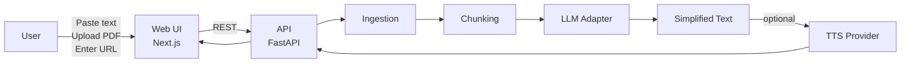

# KlarText

KlarText turns dense German or English text into easy-to-understand language and can read it aloud. It’s built for people who get overwhelmed by long sentences, legal/bureaucratic phrasing, or technical language.

> **Important:** KlarText produces “easy language” / plain-language simplifications. It is **not** certified “Leichte Sprache” and does not guarantee legal/medical accuracy.

## 🎯 Current Status

**Phase 0: ✅ Complete** (January 10, 2026)

| Component | Status | Details |
|-----------|--------|---------|
| **API Core** | ✅ Working | `/v1/simplify` endpoint with Groq LLM |
| **PDF Extraction** | ✅ Working | `/v1/ingest/pdf` with PyMuPDF |
| **Gradio Demo** | ✅ Working | Direct LLM & Via API modes |
| **Prompt Templates** | ✅ Working | German & English from `prompts/templates/` |
| **Quality Scoring** | ✅ Working | LIX, sentence length, readability |
| **Swagger Docs** | ✅ Available | `http://localhost:8000/docs` |
| Batch Endpoint | 📝 Defined | Logic pending |
| TTS | 📝 Defined | Logic pending |
| URL Extraction | 📝 Defined | Logic pending |
| Frontend (Next.js) | ⏳ Planned | Will replace Gradio |

**Quick Start:**
```bash
# First time setup:
cd services/api
cp env.example .env
# Edit .env and add your GROQ_API_KEY

# Terminal 1: API
cd services/api && uvicorn app.main:app --reload --port 8000

# Terminal 2: Demo
cd apps/demo && python app.py

# Open: http://localhost:7860
```

See `docs/phase_0_testing_guide.md` for detailed setup instructions.

## What it does (MVP)
- Paste text → get an easy-to-read version (DE/EN)
- Upload a PDF → extract text → simplify it
- Optional **Text-to-Speech (TTS)** for the simplified text
- No login required (MVP)

Stretch (optional):
- Paste a URL → extract main article text → simplify
- Chrome extension: simplify selected text or the current page

## Architecture


**Components:**
- **Ingestion** — Extract text from PDF, pasted text, or URL
- **Chunking** — Split long texts, ensure no hallucinations
- **LLM Adapter** — Configurable provider (OpenAI, Azure, Groq, Google)
- **TTS Provider** — Text-to-speech for audio output

## Tech stack (recommended)
- **Frontend:** Next.js (React), TypeScript, Tailwind (or vanilla CSS), accessible UI patterns
- **Backend:** Python + FastAPI + Uvicorn
- **LLM:** configurable provider via an adapter layer
- **PDF extraction:** PyMuPDF or pdfplumber
- **URL extraction (stretch):** trafilatura or readability-lxml
- **Rate limiting / caching (optional):** Redis
- **Storage (optional):** Postgres (metrics/logging) + local file storage in dev

## API overview
Base path: `/v1`

- `POST /v1/simplify`
  - Input: `{ text, target_lang: "de"|"en", level: "very_easy"|"easy"|"medium" }`
  - Output: `{ simplified_text, warnings?: string[] }`

- `POST /v1/ingest/pdf`
  - Input: `multipart/form-data` with `file`
  - Output: `{ extracted_text, pages, warnings?: string[] }`

- `POST /v1/ingest/url` (stretch)
  - Input: `{ url }`
  - Output: `{ extracted_text, title?, warnings?: string[] }`

- `POST /v1/tts`
  - Input: `{ text, lang: "de"|"en" }`
  - Output: `{ audio_url | audio_base64 }`

- `GET /healthz`

### Swagger / OpenAPI docs
Swagger UI: **http://localhost:8000/docs** (when API is running)  
ReDoc: **http://localhost:8000/redoc**  
OpenAPI JSON: **http://localhost:8000/openapi.json**

## Quick start (local dev)
### 1) Prereqs
- Python 3.11+
- Node.js 18+
- [Groq API key](https://console.groq.com/keys)

### 2) Backend Setup
```bash
cd services/api
cp env.example .env
# Edit .env and add your GROQ_API_KEY

# Install dependencies
pip install -r requirements.txt

# Run API server
uvicorn app.main:app --reload --port 8000
```

### 3) Frontend Setup
```bash
cd apps/web-mvp
npm install
npm run dev
```

### 4) Open
- Web: http://localhost:8080
- API: http://localhost:8000
- API docs: http://localhost:8000/docs

## Environment Variables

### Backend (`services/api/.env`)

| Variable | Required | Description |
|----------|----------|-------------|
| `GROQ_API_KEY` | Yes | Groq API key for LLM calls |
| `APP_PASSWORD` | No | Password for frontend access control |
| `ALLOWED_ORIGINS` | No | CORS origins (defaults to localhost) |
| `ENVIRONMENT` | No | `development` or `production` |

### Frontend (`apps/web-mvp/.env.local`)

| Variable | Required | Default | Description |
|----------|----------|---------|-------------|
| `VITE_API_URL` | No | `http://localhost:8000` | Backend API URL |

## Deployment

See **[docs/DEPLOYMENT.md](docs/DEPLOYMENT.md)** for full deployment instructions.

**Quick overview:**
- **Frontend**: Deploy to [Vercel](https://vercel.com) (set root to `apps/web-mvp`)
- **Backend**: Deploy to [Fly.io](https://fly.io) (uses existing Dockerfile)

```bash
# Deploy backend to Fly.io
cd services/api
fly launch --no-deploy
fly secrets set GROQ_API_KEY=your_key ALLOWED_ORIGINS=https://your-app.vercel.app
fly deploy
```

## Repo layout
- `apps/web-mvp` – Production web UI (React/Vite)
- `apps/demo` – Testing/staging Gradio app
- `services/api` – API service
- `apps/extension` – Chrome extension (optional track)
- `prompts` – prompt templates + eval fixtures
- `docs` – architecture notes + screenshots

## Design reference
Lovable prototype: https://lovable.dev/projects/7d82e6e7-3919-4389-9b79-30543806c5e0

## License
Usage & Licensing Notice (Non-Commercial)
This project, including all code, models, datasets, documentation, and related materials, is provided for personal, educational, and non-commercial research use only.

Allowed
Personal use
Academic and non-commercial research
Forking and modifying for non-commercial purposes
Contributing via pull requests
Not Allowed
Any commercial use
Selling or monetizing the software, models, datasets, or outputs
Using the project in products or services that generate revenue
Use within commercial organizations without permission
Attribution
If you share or publish derivative work, you must provide credit to:

Based on work from the KlarText Team (2025).

Commercial Licensing
To request commercial usage rights, contact a repository administrator.
